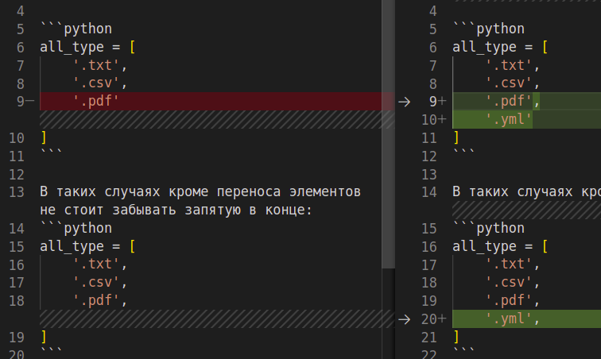

# Общие
## Запятая в конце
При написании кода, встречаются длинные последовательности:

```python
all_type = [
    '.txt',
    '.csv',
    '.pdf',
    '.yml'
]
```

В таких случаях кроме переноса элементов не стоит забывать запятую в конце:
```python
all_type = [
    '.txt',
    '.csv',
    '.pdf',
    '.yml',
]
```
Тогда при добавлении элементов git покажет только конкретные изменения:




# Dict

# List

# Tuple
## Запятая в конце?
В случае кортежа, запятая в конце покажет о том, что это именно кортеж, а не переменная:

```python
my_var = (123)
print(my_var) # 123 
print(type(my_var)) # int
```

```python
my_var = (123, )
print(my_var) # (123,) 
print(type(my_var)) # tuple
```